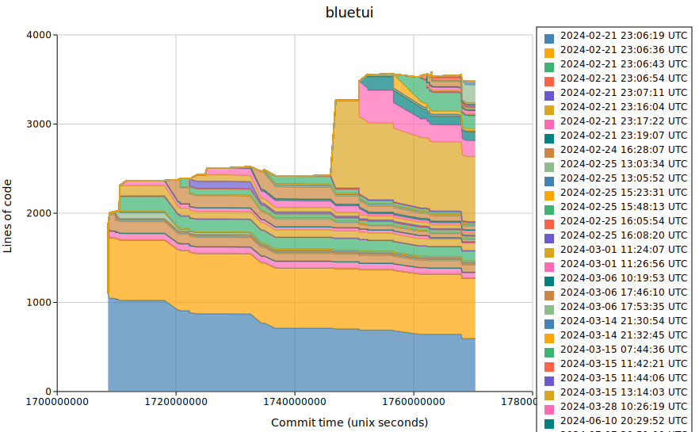

# `git-sediment`

Work in progress!

Inspired by [git-archaeology](https://github.com/koaning/gitcharts) and [git-of-theseus](https://github.com/erikbern/git-of-theseus).

## TODO

- [ ] Ability to control layering. Now it adds a layer PER commit. Maybe want like per year, per quarter-year, month etc..

- [ ] Make it faster!

- [ ] Make plot prettier

- [ ] Expereiment with other export types

- [ ] Optimize exported SVG: for big datasets its lagging the browser when viewing(!!)
